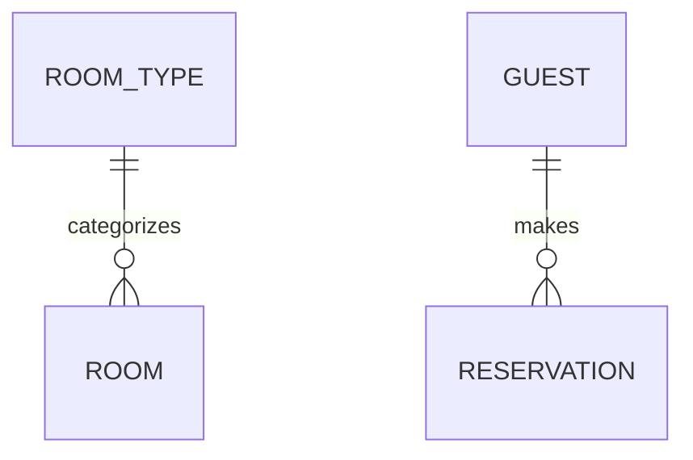

# Entity Model

## Instructions

Create or update the entity model at `docs/entity_model.md` based on `docs/requirements.md`.
The document contains an ER diagram and attribute tables.

## DO NOT

- Add attributes/columns to the Mermaid diagram
- Write prose descriptions like "Key attributes: name, email..."
- Create a "Relationships" table
- Skip the attribute tables

## Document Structure

```markdown
# Entity Model

## Entity Relationship Diagram



### ENTITY_NAME

One sentence describing the entity.

| Attribute | Description | Data Type | Length/Precision | Validation Rules      |
|-----------|-------------|-----------|------------------|-----------------------|
| id        | ...         | Long      | 19               | Primary Key, Sequence |
| ...       | ...         | ...       | ...              | ...                   |

## Required Format for Each Entity

Every entity MUST have:

1. A ### heading with ENTITY_NAME
2. One sentence description
3. An attribute table with exactly 5 columns

### Example Entity

### ROOM_TYPE

Defines categories of rooms with shared characteristics.

| Attribute   | Description              | Data Type | Length/Precision | Validation Rules          |
|-------------|--------------------------|-----------|------------------|---------------------------|
| id          | Unique identifier        | Long      | 19               | Primary Key, Sequence     |
| name        | Name of the room type    | String    | 50               | Not Null, Unique          |
| description | Detailed description     | String    | 500              | Optional                  |
| capacity    | Maximum number of guests | Integer   | 10               | Not Null, Min: 1, Max: 10 |
| price       | Price per night in CHF   | Decimal   | 10,2             | Not Null, Min: 0          |

## Mermaid Diagram Rules

- Show entity names and relationships ONLY
- NO attributes inside entity blocks
- Use relationship syntax: `ENTITY_A ||--o{ ENTITY_B : "relationship"`

## Validation Rules Reference

Use these values in the "Validation Rules" column (never leave empty):

| Attribute Type | Validation Rules Value           |
|----------------|----------------------------------|
| Primary key    | Primary Key, Sequence            |
| Required field | Not Null                         |
| Unique field   | Not Null, Unique                 |
| Foreign key    | Not Null, Foreign Key (TABLE.id) |
| Optional field | Optional                         |
| With range     | Not Null, Min: X, Max: Y         |
| With values    | Not Null, Values: A, B, C        |
| Email          | Not Null, Format: Email          |

## Data Types Reference

| Data Type | Length/Precision | Usage                 |
|-----------|------------------|-----------------------|
| Long      | 19               | IDs, foreign keys     |
| String    | varies (50-500)  | Text fields           |
| Integer   | 10               | Whole numbers         |
| Decimal   | 10,2             | Currency, percentages |
| Boolean   | 1                | True/false flags      |
| Date      | -                | Date only             |
| DateTime  | -                | Date and time         |

## Multi-Column Constraints

If validation spans multiple columns, add after the table:

**Constraints:** Check-out date must be after check-in date.

## Workflow

1. Read the requirements document
2. Use TodoWrite to create a task for each entity
3. Write the document header and ER diagram (relationships only)
4. For each entity:
    - Write ### heading
    - Write one sentence description
    - Write attribute table with 5 columns
    - Add constraints if needed
    - Mark todo complete
5. Verify every entity has an attribute table
