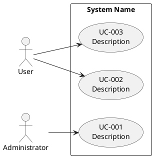

# Use Case Diagram

## Instructions

Create or update the PlantUML use case diagram at `docs/use_cases.puml` based on `docs/requirements.md`.

## DO NOT

- Create diagrams without reading the requirements first
- Use non-standard PlantUML syntax
- Include implementation details in use case names

## Template

## Conventions

- Each use case has a unique id and a description
- Use Case ID: UC-{3-digit} (UC-001, UC-002, ...)
- Each use case should trace to at least one functional requirement
- Add notes sparingly, only where relationships need clarification

## Workflow

1. Read the requirements at `docs/requirements.md`
2. Read existing diagram at `docs/use_cases.puml` (if exists)
3. Identify actors and use cases from requirements
4. Create/update the PlantUML use case diagram
5. Validate the diagram:
    - Each use case traces to at least one functional requirement in `docs/requirements.md`
    - All actors are connected to at least one use case
    - Use case IDs follow the UC-{3-digit} convention
    - PlantUML syntax is valid (no missing `@enduml`, proper arrow syntax)