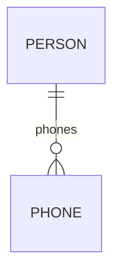

Create an entity model (docs/entity_model.md) based on docs/requirements.md as a Markdown file.
The file must include a Mermaid.js ERD diagram that shows the entity names and the relationships between the entities.
Don't add columns to the diagram.

After the diagram insert a section per entity.
Each section contains a Markdown table with the columns.
Each column has a name and description and defines its data type, including validation rules and column lengths.

Also add validation rules that may cover involve multiple columns.

By default, use sequences for the primary keys.

Template:

# Entity Model

## Entity Relationship Diagram

### Person

Stores information about a person.

| Attribute  | Description                     | Data Type | Length/Precision | Validation Rules |
|------------|---------------------------------|-----------|------------------|------------------|
| id         | Unique identifier of the entity | Long      | 19               | Primary Key      |
| first_name | First name of the person        | String    | 50               | Not Null         |
| last_name  | Last name of the person         | String    | 50               | Not Null         |

### Phone

Contains information about a phone number.

| Attribute | Description                     | Data Type | Length/Precision | Validation Rules                     |
|-----------|---------------------------------|-----------|------------------|--------------------------------------|
| id        | Unique identifier of the entity | Long      | 19               | Primary Key                          |
| number    | Phone number                    | String    | 20               | Not Null                             |
| type      | Type of phone number            | String    | 20               | Not Null, Values: Home, Work, Mobile |